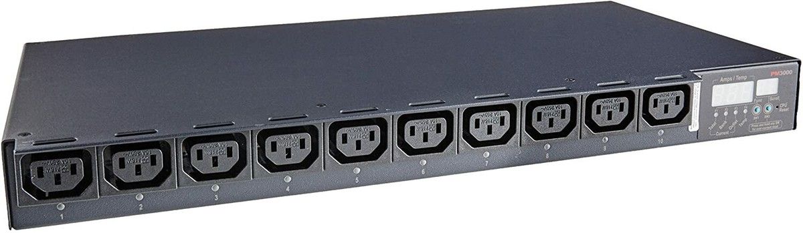

# Avocent PM3000 PDU for Home Assistant

[![hacs][hacs-badge]][hacs-url]
[![release][release-badge]][release-url]
[![license][license-badge]](LICENSE)

Home Assistant integration for **Avocent PM3000** (and PM2000) rack PDUs over
SNMPv2c — fully local. Each configured PDU appears as its own device, with the
strip totals and every outlet grouped underneath it, rather than as loose SNMP
sensors.

Outlets are exposed as switches as well as sensors, so they can be turned on and
off from Home Assistant.



Daisy-chained PDUs share one SNMP agent and are addressed by chain position;
add one entry per unit — see [Daisy-chained PDUs](#daisy-chained-pdus).

> **AI-generated** — this code was created with the help of
> [Claude](https://claude.ai) (Anthropic). Claude is recorded as a co-author in
> the git history. The code was reviewed and published by the repository owner.

---

## Requirements

* An Avocent PM3000 or PM2000 PDU reachable over the network
* SNMPv2c enabled on the PDU, with a read community
* A write community if you want to switch outlets — see
  [Switching outlets](#switching-outlets)

Home Assistant installs `pysnmp` automatically on first start, via the
`requirements` key in `manifest.json`. Restart Home Assistant after updating so
the requirement is reinstalled.

The integration ships its own brand icon in
`custom_components/avocent_pdu/brand/`. Home Assistant only reads local brand
images from 2026.3 onwards; on older versions the icon is simply not shown and
everything else works unchanged.

## Installation

### HACS

Add this repository as a custom repository of type *Integration*, install
**Avocent PM3000 PDU**, then restart Home Assistant.

### Manual

Copy `custom_components/avocent_pdu` into your Home Assistant
`config/custom_components/` directory and restart.

## Configuration

*Settings → Devices & Services → Add Integration → Avocent PM3000 PDU*

Fill in name, host, community, SNMP port, PDU ID and poll interval. The form
performs a live SNMP poll and only creates the entry if the PDU answers. Each
entry becomes its own device with all sensors grouped under it.

The poll interval can be changed later under the entry's *Configure* option.

For daisy-chained PDUs, add one entry per chain position — see
[Daisy-chained PDUs](#daisy-chained-pdus).

### Parameters

| Parameter | Required | Default | Description |
|---|---|---|---|
| `host` | ✓ | – | IP address or hostname of the PDU |
| `name` | | `PDU` | Display name (device and entity prefix) |
| `community` | | `public` | SNMPv2c read community |
| `write_community` | | – | SNMPv2c write community, needed to switch outlets; falls back to `community` |
| `port` | | `161` | SNMP UDP port |
| `pdu_id` | | `1` | PDU position in a chain (1–5) |
| `scan_interval` | | `60` | Poll interval in seconds (minimum 10) |

### Via configuration.yaml (legacy, auto-imported)

YAML remains supported for backwards compatibility. On startup each block is
imported into a config entry automatically, after which the YAML can be removed:

```yaml
sensor:
  - platform: avocent_pdu
    name: PDU01                   # display name in HA (also the device name)
    host: 192.168.1.10            # IP address of the PDU
    community: public             # SNMPv2c community string
    pdu_id: 1                     # 1 = primary PDU, 2–5 = chained PDUs
    scan_interval: 60             # poll interval in seconds (minimum 10)
```

## Daisy-chained PDUs

When several PM3000 units are daisy-chained, they share a **single IP address
and SNMP agent** — that of the primary. Each PDU in the chain is addressed by
its position through `pdu_id`: `1` is the primary, `2` the first chained unit,
and so on up to 5.

Add **one entry per PDU**, all pointing at the **same host** and differing only
in `pdu_id` and `name`. The equivalent legacy YAML:

```yaml
sensor:
  # PDU01 (primary)
  - platform: avocent_pdu
    name: PDU01
    host: 192.168.1.10
    community: public
    pdu_id: 1

  # PDU02 (chained — same host, pdu_id: 2)
  - platform: avocent_pdu
    name: PDU02
    host: 192.168.1.10            # same agent as PDU01
    community: public
    pdu_id: 2
```

Each entry produces its own device (`PDU01`, `PDU02`) with its own strip totals
and its own ten outlets. The integration filters the outlet table by `pdu_id`,
so PDU01 sees only its outlets and PDU02 only its own — verified live against a
chain of two PM3000/10/16A units.

> Two independent PDUs — separate IP addresses, not chained — are configured the
> same way, but with **different `host`** values and `pdu_id: 1` on each.

## Entities

### PDU totals (inlet / strip)

| Entity | Device class | State class | Unit |
|---|---|---|---|
| `{name} - Power` | power | measurement | W |
| `{name} - Power Avg` | power | measurement | W |
| `{name} - Current` | current | measurement | A |
| `{name} - Voltage` | voltage | measurement | V |
| `{name} - Power Factor` | power_factor | measurement | – |
| `{name} - Energy` | energy | total_increasing | kWh |

### Per outlet (sensors)

The outlet name is read from the PDU's own SNMP name column (`.5.1.4`) and used
in the friendly name, prefixed with the port number. The entity ID is derived
purely from the port number and never changes, even when the outlet is renamed
on the PDU.

| Entity (friendly name) | Device class | State class | Unit |
|---|---|---|---|
| `Port{NN} - {outlet_name} Power` | power | measurement | W |
| `Port{NN} - {outlet_name} Current` | current | measurement | A |
| `Port{NN} - {outlet_name} Voltage` | voltage | measurement | V |
| `Port{NN} - {outlet_name} Power Factor` | power_factor | measurement | – |
| `Port{NN} - {outlet_name} Energy` | energy | total_increasing | kWh |

For example `Port06 - Netapp-01 Power`, while PDU-level sensors are named
`{name} - …`, such as `PDU01 - Power`.

### Per outlet (switch)

Every outlet is also exposed as a switch (`switch.{slug(name)}_port{NN}`,
friendly name `Port{NN} - {outlet_name}`) that reflects the outlet state and
turns it on or off. The state is read from the status column (`.5`: `2` is on,
`1` is off); toggling writes the command column (`.6`: `2` switches on, `3`
switches off) through an SNMP SET.

Switching requires a write community — see
[Switching outlets](#switching-outlets).

### Entity ID scheme

Entity IDs are stable and do not change when outlets are renamed on the PDU:

```
PDU totals : sensor.{slug(name)}_pdu_{key}
             e.g.  sensor.pdu01_pdu_energy
                   sensor.pdu01_pdu_power

Per outlet : sensor.{slug(name)}_port{NN}_{key}
             e.g.  sensor.pdu01_port03_energy
                   sensor.pdu01_port03_power
                   sensor.pdu02_port10_energy
```

The friendly name always reflects the current outlet name on the PDU and is
refreshed on the next Home Assistant restart.

## Switching outlets

Outlet switches need SNMP **write** access. On most PM3000 units the default
`public` community is read-only, so a separate write community has to be set
through `write_community` — in the UI as *SNMP write community*, or in YAML. If
it is left empty the read community is reused, which only works when that
community has read-write rights on the PDU; otherwise switching fails with
`notWritable`.

The PDU may also restrict SNMP SET by source address through an ACL. If
switching times out while reads keep working, allow the Home Assistant host in
the PDU's SNMP ACL.

```yaml
sensor:
  - platform: avocent_pdu
    name: PDU01
    host: 192.168.1.10
    community: public          # read
    write_community: write     # write, for switching
    pdu_id: 1
```

## Energy dashboard

The `Energy` entities carry `device_class: energy` and
`state_class: total_increasing`, so they can be used directly in the Energy
dashboard under *Individual devices*.

A hierarchy that works well:

```
Grid
└── Basement
    ├── sensor.pdu01_pdu_energy        ← included_in_stat: basement import
    │   ├── sensor.pdu01_port01_energy ← included_in_stat: sensor.pdu01_pdu_energy
    │   ├── sensor.pdu01_port02_energy
    │   └── …
    └── sensor.pdu02_pdu_energy
        ├── sensor.pdu02_port01_energy
        └── …
```

## Register documentation

OID base: `1.3.6.1.4.1.10418.17.2.5`

Both tables are indexed by the PDU chain position `{pdu}` (1 is the primary, 2
the first chained unit). The **outlet table adds a second index component**: the
1-based outlet number within that PDU.

- PDU-level cell: `.3.1.{field}.1.{pdu}`
- Outlet cell: `.5.1.{field}.1.{pdu}.{outlet}`

| Field | PDU-level (`.3.1.{field}.1.{pdu}`) | Outlet (`.5.1.{field}.1.{pdu}.{outlet}`) | Scaling |
|---|---|---|---|
| Name / model | `.3.1.5` | `.5.1.4` | string |
| Current | `.3.1.50` | `.5.1.50` | ×0.1 A |
| Current min | `.3.1.52` | `.5.1.52` | ×0.1 A |
| Current max | `.3.1.51` | `.5.1.51` | ×0.1 A |
| Voltage | `.3.1.70` | `.5.1.70` | ×1 V |
| Power | `.3.1.60` | `.5.1.60` | ×0.1 W |
| Power min | `.3.1.62` | `.5.1.62` | ×0.1 W |
| Power max | `.3.1.61` | `.5.1.61` | ×0.1 W |
| Power avg | `.3.1.63` | `.5.1.63` | ×0.1 W |
| Power factor | `.3.1.80` | `.5.1.80` | ×0.01 |
| Energy | `.3.1.105` | `.5.1.105` | Wh → kWh |
| Outlet status (read) | – | `.5.1.5` | 1/2/3/4 |
| Outlet command (write) | – | `.5.1.6` | 2 = on, 3 = off |
| Owning PDU | – | `.5.1.8` | string, e.g. `PDU01` |

Outlet **status** (read column `.5`): `1` off, `2` on, `3` reboot,
`4` unavailable. Outlet **command** (write column `.6`): write `2` to switch on,
`3` to switch off.

The OID layout was verified live against a chain of two PM3000/10/16A units.

## Troubleshooting

**No entities after a restart.** Check SNMP reachability with
`snmpwalk -v2c -c public <IP> 1.3.6.1.4.1.10418.17.2.5.5.1.4` — this walks the
outlet-name column, so you should see your outlet labels. Then check the log
with `grep avocent_pdu home-assistant.log`.

**Entities present but `unavailable`.** Verify the community string and the
`pdu_id`: a standalone PDU is `1`, chained PDUs count up from there.

**Only the PDU totals appear, no outlets.** Make sure you are on v1.0.6 or
newer; earlier versions indexed the outlet table incorrectly and silently
dropped every outlet.

**Outlet name empty, or `Port NN` shown instead of a name.** Set the outlet
names in the PDU web UI under *Power Management → Outlets*. The entity ID is
unaffected; only the friendly name updates, on the next restart.

**`pysnmp` missing.** Home Assistant installs requirements from
`manifest.json` automatically. If that fails, run
`pip install "pysnmp>=7.1.0,<8"` in the Home Assistant virtual environment.

## Changes

Every version and its changes are listed in the [changelog](CHANGELOG.md).

## Development

Development happens on a private GitLab instance; GitHub carries the published
releases so that HACS can find them.

A tag on `main` triggers the pipeline in [`.gitlab-ci.yml`](.gitlab-ci.yml):

1. **validate** — syntax check, JSON validation, comparison of the translation
   files against each other, and a check that the manifest version matches the
   tag.
2. **hassfest** — Home Assistant's own manifest and translation checks, run in
   the same container the hassfest GitHub Action uses.
3. **package** — builds `avocent_pdu.zip` the way HACS expects it. Built once,
   so both releases ship identical bytes.
4. **release-gitlab** — uploads the zip to the generic package registry and
   publishes a GitLab release linking it. The registry is used because job
   artifacts expire and a release asset has to outlive them.
5. **release-to-github** — mirrors the commit and the tag to GitHub, creates a
   release there and attaches the same zip as an asset.

Release notes for both releases come from the matching section of
`CHANGELOG.md`.

A release is therefore made like this:

```sh
# Raise the version in custom_components/avocent_pdu/manifest.json,
# add a section to CHANGELOG.md, commit both
git tag v1.1.3
git push origin main --follow-tags
```

If the manifest version differs from the tag, the pipeline stops before
anything is published.

The pipeline needs the CI/CD variable `GITHUB_PAT` — a GitHub token with `repo`
scope, stored masked and protected.

HACS validation runs on GitHub rather than in the pipeline, because it inspects
the repository through the GitHub API — description, topics, issues and the
latest release — so it only says something meaningful once a release has been
mirrored there.

## Contributing

A bug report is most useful with the PDU model, the firmware version, an
excerpt from the Home Assistant log and, where relevant, the raw SNMP values of
the OIDs involved:

```sh
snmpwalk -v2c -c public <IP> 1.3.6.1.4.1.10418.17.2.5
```

Developed by **ChristophGoth** with AI assistance from **Claude**
([Anthropic](https://anthropic.com)). Claude is recorded as a co-author in the
git history, following the
[GitHub multiple-authors guidelines](https://docs.github.com/en/pull-requests/committing-changes-to-your-project/creating-and-editing-commits/creating-a-commit-with-multiple-authors).

## Disclaimer

This project is not affiliated with Vertiv Group Corp. or Avocent. "Avocent"
and "PM3000" are trademarks of their respective owners. Use at your own risk:
the integration can switch outlets, and therefore the equipment connected to
them, on and off.

## License

[MIT](LICENSE)

[hacs-badge]: https://img.shields.io/badge/HACS-Custom-41BDF5.svg
[hacs-url]: https://hacs.xyz
[release-badge]: https://img.shields.io/github/v/release/ChristophGoth/ha-avocent-pdu?display_name=tag
[release-url]: https://github.com/ChristophGoth/ha-avocent-pdu/releases
[license-badge]: https://img.shields.io/badge/license-MIT-blue.svg
